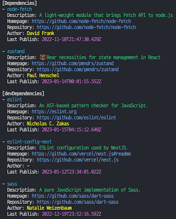

# mypkg-cli

A command-line tool to analyze the dependencies of a Node.js project and display information about the packages.

## Installation

To install `mypkg-cli`,

use npm: `npm install -g mypkg-cli`

## Usage

To analyze the dependencies of your project, navigate to the project directory and run the following command:
`mypkg [options]`

### Options

- `-D, --dev`: Include only devDependencies
- `-N, --no-dev`: Include only Dependencies
- `-d, --desc`: Show package description
- `-l, --link`: Show package homepage and repository
- `-a, --author`: Show package author
- `-p, --publish`: Show package last publish date
- `-h, --help`: Display help message

### Examples

Analyze all dependencies: `mypkg`  
Analyze only devDependencies: `mypkg -D`  
Exclude devDependencies from analysis: `mypkg -N`  
Show package descriptions: `mypkg -d`  
Show package homepage and repository: `mypkg -l`  
Show package author: `mypkg -a`  
Show package last publish date: `mypkg -p`  
Combine options: `mypkg -d -a -p`

## Output

The tool will display information about the dependencies in your project. Each package will be listed with its name and the selected information based on the provided options.

Example output:

## License

This project is licensed under the MIT License.
